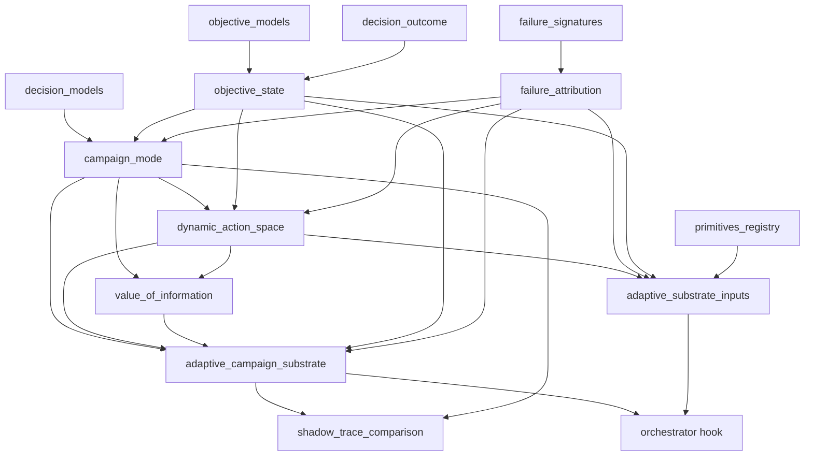

# Adaptive Campaign Substrate (shadow)

Status: **shadow-only, observational**. Nothing in this document affects live
routing, strategy selection, candidate selection, or action execution. Every
component is gated, deterministic, JSON-safe, replayable, and fail-open.

This is the code map for the campaign-level adaptive decision *substrate* added
on top of the existing dynamic strategy meta-controller. It answers, per round,
"what kind of scientific activity does the campaign need next, and how should
the action space and candidate value be viewed?" — as an **advisory** artifact
recorded alongside the campaign, never as a control signal.

---

## Two parallel shadow tracks

Both are recorded per round from the same round state and never overwrite each
other. Each is gated by its own flag (default off).

| Track | Flag | Vocabulary | Log key |
|-------|------|-----------|---------|
| Legacy contextual decision | `CONTEXTUAL_DECISION_SHADOW_ENABLED` | `CampaignDecisionAction` | `contextual_shadow_decision_trace` |
| Adaptive campaign substrate | `ADAPTIVE_SUBSTRATE_SHADOW_ENABLED` | `CampaignMode` + action labels + VoI | `adaptive_campaign_substrate_snapshot` |

The two tracks are reconciled offline by `shadow_trace_comparison` via a shared
equivalence-class mapping (see below).

---

## Module map

| Module | Phase | Responsibility | Key exports |
|--------|-------|----------------|-------------|
| `objective_models.py` | (pre-existing) | Static metric hierarchy + proxy-gap types | `MetricNode`, `ObjectiveStack`, `ProxyGapAssessment` |
| `objective_state.py` | 1 | Evolving, versioned objective state + revision accounting | `ObjectiveState`, `ObjectiveRevision`, `StoppingCriteria`, `ObjectiveStateUpdater` |
| `failure_signatures.py` | (pre-existing) | Rule-based failure classification | `FailureSignature`, `classify_failure` |
| `failure_attribution.py` | 2 | Distributional failure attribution (6 categories) | `FailureAttributionCategory`, `FailureAttributionDistribution`, `attribute_failure` |
| `campaign_mode.py` | 3 | Deterministic per-round mode transition table | `CampaignMode`, `CampaignModeContext`, `CampaignModeDecision`, `decide_campaign_mode` |
| `dynamic_action_space.py` | 4 | Per-mode shadow action assessment | `ActionSpec`, `ActionShadowLabel`, `ActionAssessment`, `DynamicActionSpaceSnapshot`, `build_action_space_snapshot` |
| `value_of_information.py` | 5 | Non-myopic decision-value scoring (advisory) | `ActionValueSignals`, `CandidateActionScore`, `ValueOfInformationSnapshot`, `score_value_of_information` |
| `adaptive_campaign_substrate.py` | bridge | Single artifact bundling phases 1–5 | `AdaptiveCampaignSubstrateSnapshot`, `build_adaptive_campaign_substrate_snapshot` |
| `adaptive_substrate_inputs.py` | 5.6 | Read-only mappers: round state → substrate inputs | `objective_state_from_input`, `failure_attribution_from_events`, `campaign_instruments_from_protocol`, `action_specs_from_registry`, `available_capabilities` |
| `shadow_trace_comparison.py` | 5.7 | Compare the two tracks; sanity + calibration findings | `compare_shadow_tracks`, `summarize_comparisons`, `ShadowEquivalenceClass`, `parse_substrate_log_line` |

Legacy shadow track (unchanged, referenced for comparison): `decision_models.py`,
`decision_layer.py`, `decision_trace.py`, `decision_outcome.py`,
`decision_replay.py`, `round_context.py`.

Wiring: `orchestrator.py` records both tracks; `core/config.py` holds both flags.

---

## Dependency graph



---

## Per-round data flow

```
CampaignDecisionOutcome ─┐
                         ├─► ObjectiveState (per-round snapshot; Phase 1)
input_data ──────────────┘
FailureSignature ─► FailureAttributionDistribution (Phase 2)
safety_summary ─┐
                ▼
        CampaignModeDecision (Phase 3, priority-ordered)
                │
                ▼
        DynamicActionSpaceSnapshot (Phase 4, per-mode labels)
                │
                ▼
        ValueOfInformationSnapshot (Phase 5, advisory ranking)
                │
                ▼
        AdaptiveCampaignSubstrateSnapshot (bundle) ──► shadow log
                                                       │
                                       shadow_trace_comparison (offline)
```

`adaptive_substrate_inputs` maps live round state (registry, protocol, failure
events, objective KPI, safety summary) into the typed inputs above. The
orchestrator hook composes these read-only.

---

## CampaignMode priority (first match wins)

| Rank | Mode | Trigger |
|------|------|---------|
| 1 | `STOP_RECOMMENDED` | `ObjectiveState.stop_recommended` |
| 2 | `SAFETY_CONSTRAINT_TIGHTENING` | high safety risk (`blocking` / `risk_level∈{high,blocking,critical}` / `requires_constraint_update`) |
| 3 | `HUMAN_OBSERVATION_REQUEST` | failure with attribution confidence < 0.5 |
| 4 | `CALIBRATION` | confident instrument failure |
| 5 | `FAILURE_DIAGNOSIS` | any other confident failure (fail closed) |
| 6 | `VALIDATION` | `proxy_gap` level HIGH |
| 7 | `LITERATURE_CONTEXT_SEEKING` | `literature_missing` |
| 8 | `BO_OPTIMIZATION` | default |

## Shadow equivalence mapping (comparison)

| Class | Legacy `CampaignDecisionAction` | Substrate `CampaignMode` |
|-------|-------------------------------|--------------------------|
| STOP | STOP_CAMPAIGN | STOP_RECOMMENDED |
| OPTIMIZATION | PROPOSE_CANDIDATES | BO_OPTIMIZATION |
| OBJECTIVE_INTEGRITY | REVISE_OBJECTIVE, RUN_VALIDATION | VALIDATION |
| FAILURE_HANDLING | RECOVER_FAILURE | CALIBRATION, FAILURE_DIAGNOSIS |
| HUMAN_OBSERVATION | REQUEST_HUMAN_OBSERVATION | HUMAN_OBSERVATION_REQUEST |
| CONTEXT_SEEKING | QUERY_LITERATURE | LITERATURE_CONTEXT_SEEKING |
| CONSTRAINT | TIGHTEN_CONSTRAINTS | SAFETY_CONSTRAINT_TIGHTENING |

Two sides in the same class → **agree**; otherwise a typed divergence.

## Action kind vocabulary & per-mode labels

`ActionSpec.kind` ∈ `experiment | preparation | cleanup | calibration |
diagnostic | report | workflow`. Missing required capability always yields
`proposed_disabled` (highest precedence). Otherwise, by mode:

| Mode | preferred | risky | proposed_disabled | neutral |
|------|-----------|-------|-------------------|---------|
| BO_OPTIMIZATION | low-risk experiment/optimization | high-risk experiment | — | others |
| CALIBRATION | calibration | actions on implicated instrument | — | others |
| FAILURE_DIAGNOSIS | diagnostic | actions reusing failing capability | — | others |
| VALIDATION | validation | — | — | others |
| LITERATURE_CONTEXT_SEEKING | literature | — | — | others |
| SAFETY_CONSTRAINT_TIGHTENING | diagnostic, calibration | experiment, preparation, workflow | — | report, cleanup, validation, literature |
| STOP_RECOMMENDED | — | — | experiment, preparation, workflow | report, cleanup |

## Comparison findings

- **divergences**: `class_mismatch`, `substrate_missing_constraint_mode`.
- **sanity** (substrate absurdity): `voi_recommends_disabled`,
  `failure_ignored_by_mode`, `all_disabled_non_stop`,
  `calibration_without_instrument_failure`, `diagnosis_without_failure`.
- **calibration** (mapper correction signals): `experiment_without_capability`,
  `capability_mapping_inconsistency`, `attribution_known_type_as_external`.

---

## Feature flags

| Env var | Default | Effect |
|---------|---------|--------|
| `CONTEXTUAL_DECISION_SHADOW_ENABLED` | `false` | Record the legacy contextual decision trace |
| `ADAPTIVE_SUBSTRATE_SHADOW_ENABLED` | `false` | Record the adaptive campaign substrate snapshot |

Both independent; enable both to compare tracks on real rounds.

---

## Status vs v3.md priorities

| v3.md priority | Status |
|----------------|--------|
| #1 ObjectiveState + revision accounting | Done (per-round snapshot in the hook; cross-round evolution pending) |
| #2 DynamicActionSpace | Done (shadow snapshot; no real enable/disable, no composite registration) |
| #3 CampaignMode transition system | Done (+ SAFETY_CONSTRAINT_TIGHTENING) |
| #4 FailureAttribution distribution | Done (InstrumentBeliefState / PUDA deferred) |
| #5 Value-of-Information scoring | Done (advisory; `expected_hypothesis_resolution` needs a HypothesisState) |
| #6 OperationalAbstractionLearner | Not started |

### Known gaps / next
- **proxy_gap threading**: the per-round `ObjectiveState` built in the hook has
  `proxy_gap=None`, so the substrate never enters VALIDATION on real rounds
  (surfaces as a `class_mismatch` divergence). Needs a real proxy-gap source.
- **per-round safety signal**: the hook feeds the static `policy_snapshot`
  (matching the legacy track); a genuine per-round safety/QC signal source is
  still open.
- **heat metadata**: `heat` lacks an `instrument` in `agent/skills/utility.md`
  and is kept as `experiment` via a temporary pending-set so its
  `experiment_without_capability` flag remains a true positive.
- **HypothesisState** (v3.md §3) not implemented; VoI hypothesis term stays 0.

---

## Boundaries / invariants

- Shadow-only: never changes routing, strategy selection, candidate selection,
  or action execution. Return values of the orchestrator hooks are ignored.
- VoI ranking is advisory; the substrate marks `voi_ranking_advisory_only`.
- Deterministic: injected `now`; stable tie-breaks; JSON-safe; replayable.
- Fail-open: hook failures are logged and swallowed; the live campaign continues.
- Additive/backward-compatible: only optional fields added; the legacy
  decision-shadow track is untouched.

## Tests

102 tests across `test_objective_state`, `test_failure_attribution`,
`test_campaign_mode`, `test_dynamic_action_space`, `test_value_of_information`,
`test_adaptive_campaign_substrate`, `test_adaptive_substrate_inputs`,
`test_adaptive_substrate_hook`, `test_shadow_trace_comparison`.
