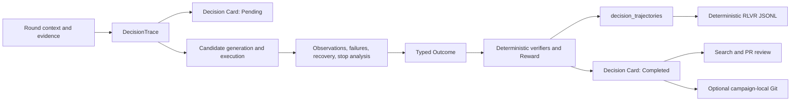

# Scientific Decision Ledger

## Purpose

The Scientific Decision Ledger turns HELIOS campaign reasoning into durable,
human-readable scientific artifacts. It is more than a log: every Decision
Card connects the question, evidence, alternatives, chosen action, expected
gain, observed outcome, deterministic reward, failure attribution, recovery,
and the versions of code, policy, rubric, and Nexus contract that produced it.

The design supports five uses from one trace:

1. Git and pull-request review of scientific work.
2. Exact-text Scientific Memory retrieval without an embedding dependency.
3. Reproducibility and audit of strategy changes.
4. Paper-ready decision trajectories and policy/Nexus evolution.
5. Typed decision-trajectory export for supervised learning, RLVR, replay, and
   later Runtime Agent evaluation.

## Authority and Data Model

The ledger is a projection, not the campaign transaction engine:

| Layer | Authority | Failure behavior |
|---|---|---|
| Typed decision DTOs and SQLite `decision_trajectories` | Runtime and machine-readable source of truth | Persistence failure is reported by the accounting call |
| Markdown artifacts | Human-readable, deterministic scientific projection | Orchestrator hooks are fail-open and do not change routing |
| Campaign-local Git | Optional version history for Markdown only | Disabled by default; no repository means no commit unless auto-init is enabled |

Markdown is never parsed to calculate reward or construct RLVR rows. The
machine export is rebuilt from the typed trajectory table, so a manual Markdown
edit cannot silently become training truth.

## Live Lifecycle



The orchestrator captures a decision trace whenever either the legacy
contextual shadow log or the Scientific Ledger is enabled. This means ledger
capture does not depend on enabling verbose shadow logging. Terminal authority
decisions, deferred validation/recovery/context decisions, design failures, and
ordinary completed rounds all close their Decision Card.

## Artifact Layout

Each campaign uses a traversal-safe, collision-resistant directory component:

```text
<SCIENTIFIC_LEDGER_ROOT>/campaigns/<campaign>/
  campaign.md
  index.md
  summary.md
  trajectory.md
  policy.md
  policy_versions/<policy-version>.md
  nexus.md
  training_dataset.md
  rounds/<round>/
    objective.md
    observations.md
    decision_<round>.md
    strategy.md
    evidence.md
    failure.md
    recovery.md
    summary.md
```

Every artifact is Markdown with YAML front matter. A Decision Card uses schema
`helios.decision-card/v1`; the renderer version and a SHA-256 of the redacted
source bundle are recorded for deterministic comparison. Campaign summaries
and the Mermaid trajectory are regenerated after every lifecycle transition.

`policy.md` shows the current policy state. The first observed projection of
each policy version is retained under `policy_versions/`, making policy
evolution reviewable as ordinary Git history. `nexus.md` independently records
Nexus diagnostics and its contract/schema version, preserving the boundary:
Nexus supplies diagnosis and characterization evidence; HELIOS owns the next
campaign action.

## Decision Card Contract

A complete card contains:

- `Question`: the campaign-level decision being answered.
- `Context`: objective, constraints, failures, safety, memory, Nexus,
  validation, human observation, and literature inputs supplied to the policy.
- `Evidence`: structured evidence source, type, summary, and weight.
- `Candidate Actions`: ranked alternatives with improvement, information gain,
  risk, utility, and reason when the policy provides them.
- `Chosen`: action and backend selected by HELIOS.
- `Decision Rationale`: the policy explanation and fallback.
- `Confidence and Expected Gain`: decision confidence and selected utility
  components.
- `Outcome`: observed execution, candidate count, objective/proxy-gap delta,
  validation, recovery, context, and human-override state.
- `Reward and Verification`: total/process/outcome reward, regret, rubric
  version, and the complete verifier table.
- `Failure and Recovery`: linked counts plus dedicated detailed artifacts.
- `Reproducibility`: code commit/dirty state, policy ID/version, Nexus contract,
  reward rubric, and renderer version.

## Scientific Memory API

The endpoints are read-only:

```http
GET /api/v1/memory/scientific/search?q=pipette%20offset&campaign_id=campaign-32
GET /api/v1/memory/scientific/campaign-32/artifact?path=rounds/003/failure.md
GET /api/v1/memory/scientific/campaign-32/rlvr
```

Search is deterministic, case-insensitive exact-text matching across Markdown.
Results include the campaign, campaign-local artifact path, title, line number,
and snippet. This makes a phrase such as `pipette offset` immediately
retrievable without a vector database. The artifact endpoint accepts only a
campaign-local `.md` path and rejects absolute paths, `.git`, and traversal.

RLVR rows use schema `helios.rlvr/v1` and include context, candidates, chosen
action/backend, rationale, confidence, outcome, reward, verifier report,
rubric/trajectory versions, and creation time. Output ordering and JSON key
ordering are deterministic.

## Git Semantics

Set `SCIENTIFIC_LEDGER_GIT_ENABLED=true` to record local history. With
`SCIENTIFIC_LEDGER_GIT_AUTO_INIT=true`, HELIOS initializes one repository inside
each campaign directory. The implementation:

- never initializes or commits to the HELIOS source repository;
- never switches branches and therefore avoids cross-campaign branch races;
- stages only the exact changed `.md` paths for the lifecycle transition;
- rejects paths outside the campaign and non-Markdown paths;
- uses a sanitized local author and single-line commit message;
- never configures a remote and never pushes.

The Pending and Completed transitions normally become separate commits, so Git
diff directly shows how evidence, confidence, outcome, reward, or recovery
changed.

## Safety and Consistency

- Sensitive keys and recognizable bearer tokens, OpenAI-style keys, and JWTs
  are recursively redacted before hashing or rendering.
- Campaign and artifact paths are normalized, collision-resistant, and checked
  after filesystem resolution to prevent traversal and symlink escape.
- Writes use a per-campaign thread/process lock, a same-directory temporary
  file, `fsync`, and atomic replacement.
- Repeating an identical write is idempotent and produces no new Git commit.
- Ledger and Git hooks are best-effort in the orchestrator so reporting cannot
  redirect or stop a scientific campaign.
- Git is local-only. Publication or remote synchronization remains an explicit
  operator action.

## Configuration

| Variable | Default | Meaning |
|---|---|---|
| `SCIENTIFIC_LEDGER_ENABLED` | `true` | Capture live typed accounting and Markdown artifacts |
| `SCIENTIFIC_LEDGER_ROOT` | `<DATA_DIR>/scientific_ledger` | Artifact root |
| `SCIENTIFIC_LEDGER_GIT_ENABLED` | `false` | Enable campaign-local commits |
| `SCIENTIFIC_LEDGER_GIT_AUTO_INIT` | `true` | Initialize a missing campaign repository when Git is enabled |
| `SCIENTIFIC_LEDGER_GIT_AUTHOR_NAME` | `HELIOS Scientific Ledger` | Commit author name |
| `SCIENTIFIC_LEDGER_GIT_AUTHOR_EMAIL` | `helios-ledger@localhost` | Commit author email |

When enabled, the ledger root is included in startup writable-directory
validation. It is ignored by the HELIOS source repository.
